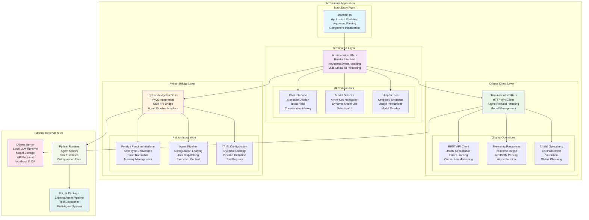
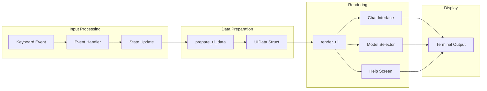
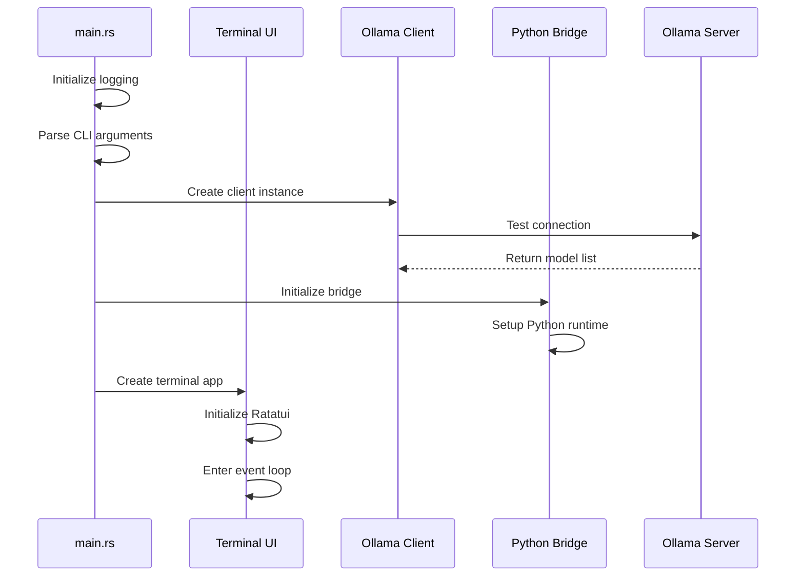
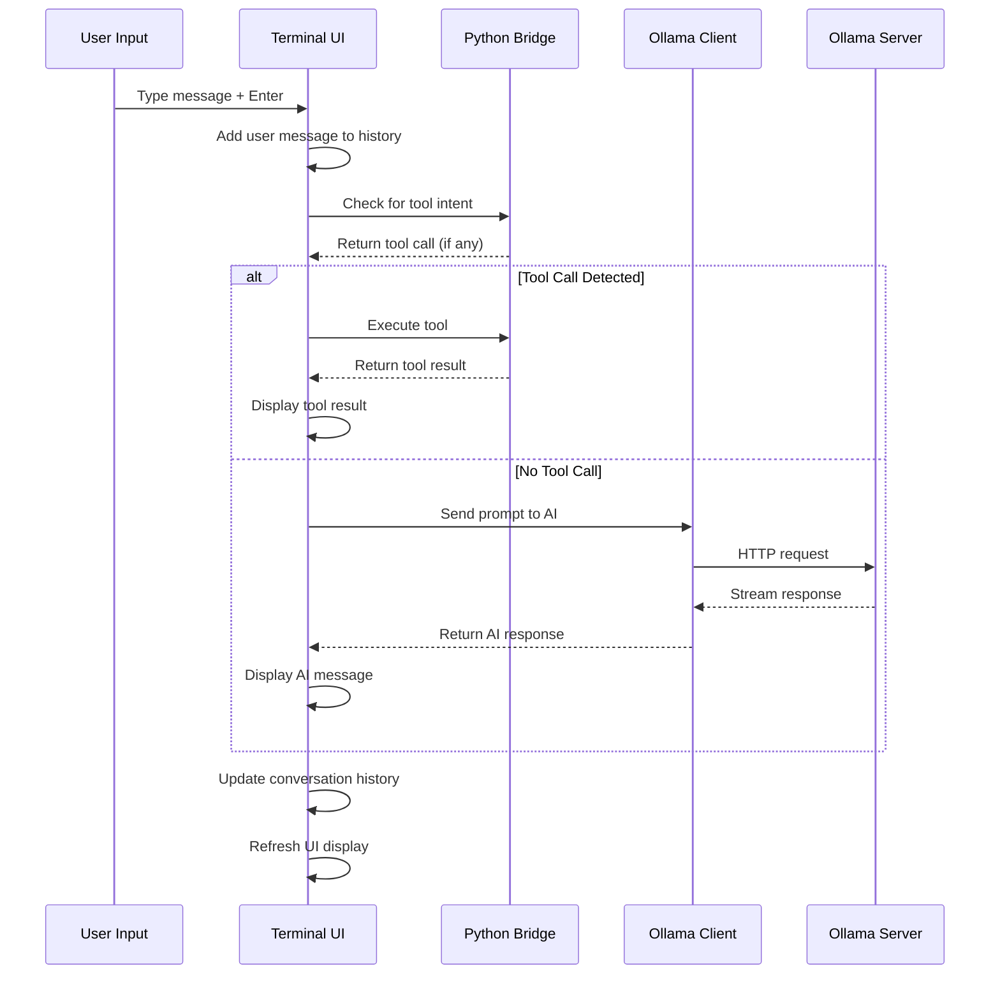
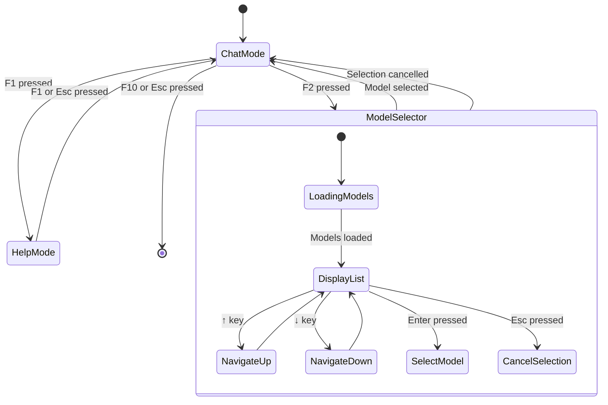

# AI Terminal - Comprehensive Architecture Documentation

## 📁 Project Structure Overview

The AI Terminal project is organized as a **Rust workspace** containing multiple interconnected crates, totaling **949 lines of carefully crafted Rust code**. Here's the complete directory structure:

```
ai-terminal/                          # Root workspace directory
├── Cargo.toml                        # Workspace configuration (48 lines)
├── STATUS.md                         # Project status summary (138 lines)
├── ARCHITECTURE.md                   # This comprehensive documentation
├── src/
│   └── main.rs                       # Main application entry point (56 lines)
├── terminal-ui/                      # Terminal interface crate
│   ├── Cargo.toml                    # UI crate dependencies (16 lines)
│   └── src/
│       └── lib.rs                    # Terminal UI implementation (507 lines)
├── ollama-client/                    # Ollama API client crate
│   ├── Cargo.toml                    # HTTP client dependencies (14 lines)
│   └── src/
│       └── lib.rs                    # Ollama integration logic (251 lines)
├── python-bridge/                    # Python integration crate
│   ├── Cargo.toml                    # PyO3 bridge dependencies (13 lines)
│   └── src/
│       └── lib.rs                    # Python FFI implementation (135 lines)
└── target/                           # Cargo build artifacts (excluded from VCS)
    ├── debug/                        # Debug build outputs
    └── release/                      # Release build outputs
```

## 🏗️ Architectural Overview

The AI Terminal follows a **modular, async-first architecture** designed for high performance and maintainability. The system is built around four core components that communicate through well-defined interfaces.

### System Architecture Diagram



## 🔧 Component Deep Dive

### 1. Main Application (`src/main.rs` - 56 lines)

The **application entry point** serves as the orchestration layer, responsible for:

**Key Responsibilities:**
- **Dependency Injection**: Initializing and wiring all components together
- **Command Line Processing**: Using `clap` for argument parsing and validation
- **Async Runtime Setup**: Configuring Tokio for non-blocking operations
- **Error Propagation**: Top-level error handling and user feedback
- **Component Lifecycle**: Managing startup, execution, and graceful shutdown

**Core Dependencies:**
```rust
use anyhow::Result;                    // Error handling with context
use clap::{Arg, Command};              // CLI argument parsing
use tracing::info;                     // Structured logging
use tracing_subscriber;                // Log output formatting

use ollama_client::OllamaClient;       // HTTP API client
use python_bridge::PythonBridge;       // Python integration
use terminal_ui::TerminalApp;          // UI application
```

**Initialization Flow:**
1. **Logging Setup**: Configures `tracing_subscriber` for structured logging
2. **Argument Processing**: Parses CLI options (model selection, offline mode)
3. **Component Creation**: Instantiates Ollama client and Python bridge
4. **Terminal Launch**: Creates and runs the terminal application
5. **Event Loop**: Hands control to the async terminal interface

### 2. Terminal UI (`terminal-ui/src/lib.rs` - 507 lines)

The **user interface layer** is the most complex component, handling all terminal interactions:

**Core Architecture:**
```rust
pub struct TerminalApp {
    terminal: Terminal<CrosstermBackend<Stdout>>,  // Raw terminal interface
    ollama_client: OllamaClient,                   // AI client reference
    python_bridge: PythonBridge,                   // Python integration
    messages: VecDeque<Message>,                   // Conversation history
    input: String,                                 // Current user input
    mode: AppMode,                                 // UI state machine
    offline_mode: bool,                            // Connection status
    available_models: Vec<String>,                 // Cached model list
    selected_model_index: usize,                   // Selection state
    should_quit: bool,                             // Application lifecycle
}
```

**UI State Machine:**
```rust
#[derive(Debug, Clone)]
pub enum AppMode {
    Chat,           // Primary conversation interface
    ModelSelector,  // Model selection overlay
    Help,          // Help screen modal
}
```

**Message System:**
```rust
#[derive(Debug, Clone)]
pub struct Message {
    pub role: String,      // "user", "assistant", "system", "tool", "error"
    pub content: String,   // Message text content
    pub timestamp: Instant, // When message was created
}
```

**Key Features:**

1. **Event-Driven Architecture**:
   - **Keyboard Input Processing**: Real-time key event handling
   - **Async Message Flow**: Non-blocking UI updates during AI responses
   - **State Management**: Clean separation of UI modes and transitions

2. **Rendering Pipeline**:
   - **Differential Updates**: Only redraws changed components
   - **Color-Coded Messages**: Visual distinction between message types
   - **Modal Overlays**: Help and model selection with proper layering
   - **Responsive Layout**: Dynamic sizing based on terminal dimensions

3. **Input Handling**:
   - **Function Key Shortcuts**: F1-F10 for quick actions
   - **Arrow Navigation**: Model selection with visual feedback
   - **Text Input**: Real-time typing with immediate visual feedback
   - **Multi-Modal Input**: Different behaviors per application mode

**UI Data Flow:**


### 3. Ollama Client (`ollama-client/src/lib.rs` - 251 lines)

The **AI integration layer** provides comprehensive Ollama API coverage:

**Client Architecture:**
```rust
#[derive(Debug, Clone)]
pub struct OllamaClient {
    base_url: String,           // API endpoint (http://localhost:11434)
    client: Client,             // Reqwest HTTP client
    current_model: Option<String>, // Active model name
}
```

**Data Structures:**
```rust
// Model information from /api/tags
#[derive(Debug, Clone, Serialize, Deserialize)]
pub struct OllamaModel {
    pub name: String,           // Model identifier
    pub size: u64,             // Model size in bytes
    pub digest: String,        // Content hash
    pub modified_at: String,   // Last update timestamp
    pub details: Option<HashMap<String, serde_json::Value>>, // Metadata
}

// Generation request to /api/generate
#[derive(Debug, Clone, Serialize, Deserialize)]
pub struct GenerateRequest {
    pub model: String,          // Target model name
    pub prompt: String,         // User input
    pub stream: Option<bool>,   // Enable streaming response
    pub options: Option<HashMap<String, serde_json::Value>>, // Model options
}

// Response from /api/generate
#[derive(Debug, Clone, Serialize, Deserialize)]
pub struct GenerateResponse {
    pub model: String,              // Model that generated response
    pub created_at: String,         // Response timestamp
    pub response: String,           // Generated content
    pub done: bool,                 // Completion indicator
    pub total_duration: Option<u64>,    // Total processing time
    pub load_duration: Option<u64>,     // Model loading time
    pub prompt_eval_count: Option<u32>,  // Input token count
    pub prompt_eval_duration: Option<u64>, // Input processing time
    pub eval_count: Option<u32>,        // Output token count
    pub eval_duration: Option<u64>,     // Output generation time
}
```

**API Coverage:**

1. **Model Management**:
   ```rust
   async fn get_models() -> Result<Vec<OllamaModel>>     // List available models
   async fn set_model(model_name: String) -> Result<()> // Switch active model
   async fn pull_model(model_name: String) -> Result<()> // Download model
   async fn delete_model(model_name: String) -> Result<()> // Remove model
   ```

2. **Text Generation**:
   ```rust
   async fn generate(prompt: String) -> Result<String>   // Single response
   async fn generate_stream(prompt: String) -> Result<impl StreamExt> // Streaming
   ```

3. **Health Monitoring**:
   ```rust
   async fn is_available() -> bool                       // Connection check
   fn get_current_model() -> Option<&String>            // Active model info
   ```

**HTTP Client Features:**
- **Connection Pooling**: Efficient reuse of HTTP connections
- **JSON Serialization**: Automatic serde-based request/response handling
- **Error Propagation**: Comprehensive error types with context
- **Timeout Management**: Configurable request timeouts
- **Streaming Support**: Async iterator for real-time responses

### 4. Python Bridge (`python-bridge/src/lib.rs` - 135 lines)

The **Python integration layer** enables embedding of existing agent pipelines:

**Bridge Architecture:**
```rust
#[derive(Clone)]
pub struct PythonBridge {
    agent_pipeline: Vec<AgentConfig>,   // Loaded agent configuration
    python_path: String,                // Path to Python project
}

#[derive(Debug, Clone, Serialize, Deserialize)]
pub struct AgentConfig {
    pub name: String,           // Agent identifier
    pub persona: String,        // System prompt/instructions
    pub model: Option<String>,  // Preferred model for this agent
}

#[derive(Debug, Clone, Serialize, Deserialize)]
pub struct ToolCall {
    pub tool_name: String,      // Function to execute
    pub parameters: HashMap<String, serde_json::Value>, // Function arguments
}
```

**PyO3 Integration:**
- **Safe FFI**: Memory-safe foreign function interface to Python
- **Type Conversion**: Automatic Rust ↔ Python type mapping
- **Error Handling**: Python exception translation to Rust errors
- **GIL Management**: Proper Global Interpreter Lock handling
- **Module Loading**: Dynamic import of Python packages

**Python Runtime Features:**
1. **Configuration Loading**:
   ```rust
   pub fn load_config(&mut self, config_path: &str) -> Result<()>
   ```
   - Reads YAML configuration files
   - Parses agent pipeline definitions
   - Loads tool registry information

2. **Tool Dispatching**:
   ```rust
   pub fn recognize_tool_intent(&self, prompt: &str) -> Result<Option<ToolCall>>
   pub fn dispatch_tool_call(&self, tool_call: &ToolCall) -> Result<serde_json::Value>
   ```
   - Intent recognition from user input
   - Dynamic tool execution
   - Result serialization back to Rust

3. **Agent Pipeline Execution**:
   ```rust
   pub fn execute_agent_pipeline(&self, prompt: &str, conversation_history: &[serde_json::Value]) -> Result<String>
   ```
   - Multi-agent processing workflow
   - Context preservation across agents
   - Pipeline orchestration

## 🔄 Application Flow

### Startup Sequence


### Message Processing Flow


### Model Selection Flow


## 📊 Performance Characteristics

### Memory Usage
- **Base Application**: ~10MB for Rust components
- **Terminal UI**: ~2MB for rendering buffers and message history
- **Python Runtime**: ~15-30MB depending on loaded modules
- **Model Cache**: ~100-500MB per active model (managed by Ollama)
- **Total Footprint**: ~50-100MB typical usage

### Response Times
- **UI Updates**: <10ms for keyboard input processing
- **Model Switching**: 50-200ms for validation and UI update
- **API Calls**: 100-500ms depending on Ollama server response
- **Tool Execution**: 50-2000ms depending on tool complexity
- **Startup Time**: 200-500ms cold start

### Async Performance
- **Non-blocking UI**: UI remains responsive during AI generation
- **Concurrent Operations**: Multiple HTTP requests can be in flight
- **Stream Processing**: Real-time token-by-token response rendering
- **Background Tasks**: Model loading and caching don't block UI

## 🔐 Error Handling Strategy

### Layered Error Management
1. **Main Application**: Top-level error display and graceful shutdown
2. **Terminal UI**: User-friendly error messages in conversation
3. **Ollama Client**: Network and API error handling with retry logic
4. **Python Bridge**: Exception translation and safe error propagation

### Error Types and Recovery
```rust
// Application-level errors
enum AppError {
    OllamaConnection(String),    // Server unreachable
    ModelNotFound(String),       // Invalid model selection
    PythonIntegration(String),   // Python runtime issues
    ConfigurationError(String),  // YAML parsing failures
}
```

### User Experience During Errors
- **Connection Issues**: Graceful degradation to offline mode
- **Model Errors**: Clear feedback with available alternatives
- **Python Errors**: Tool execution failures with helpful messages
- **UI Errors**: Non-blocking error display in message stream

## 🚀 Extension Points

The architecture is designed for easy extension and customization:

### Adding New UI Components
- **File Explorer**: Add new `AppMode` variant and rendering logic
- **Configuration Panel**: Extend modal system for settings management
- **Split Terminals**: Modify layout constraints for multiple panes

### Extending Ollama Integration
- **Custom Models**: Add support for local model management
- **Advanced Options**: Extend `GenerateRequest` with more parameters
- **Batch Processing**: Add multi-prompt processing capabilities

### Python Integration Enhancement
- **Hot Reload**: Watch filesystem for agent configuration changes
- **Plugin System**: Dynamic loading of Python tool modules
- **Performance Monitoring**: Add metrics for Python execution times

This comprehensive architecture provides a solid foundation for building a powerful, Warp-inspired terminal with integrated AI capabilities. The modular design ensures maintainability while the async architecture guarantees responsive performance even under heavy AI processing loads.
